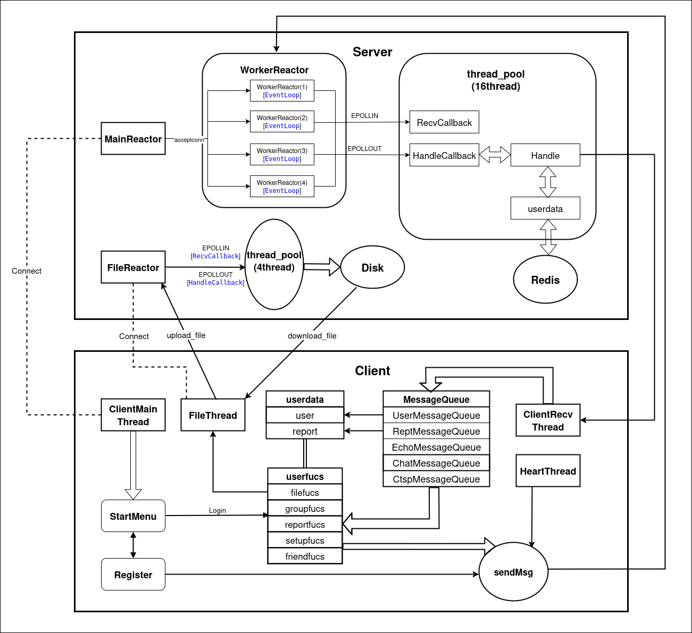

---
# 聊天室系统用户文档
---

## 部署与运行指南

### 1. 环境准备

* Linux系统（推荐 Ubuntu、CentOS 等）
* 安装Redis服务并以项目内redis.conf配置文件启动
* 确保C++编译环境（支持C++11及以上）
* 若缺少依赖，请运行项目根目录下的安装依赖脚本：

```bash
./install_dependencies.sh
```
**该脚本提供以下依赖：**
* **build-essential**：提供编译工具，支持C++代码编译。
* **libc6-dev**：C语言标准库开发包。
* **libhiredis-dev**：与 Redis 进行通信的客户端库。
* **libsodium-dev**：用于加密和解密功能的库。
* **libcurl4-openssl-dev**：用于发送邮件的网络请求库。
* **libgoogle-glog-dev**：Google的日志库，用于记录日志信息。

---

### 2. 获取代码

```bash
git clone git@github.com:jianger-yu/Chatroom.git
cd Chatroom
```

---

### 3. 启动服务器

```bash
./start_server.sh [ip] [port]
```

* 启动主Reactor监听连接
* 自动启动若干从Reactor线程负责事件处理
* 可选指定IP和端口，不传默认使用配置文件内设定

---

### 4. 启动客户端

```bash
./start_client.sh [ip] [port]
```

* CLI界面，连接服务器指定地址及端口
---
## 项目架构


---

## 1. 系统环境与架构

* **操作系统**：Linux（推荐 Ubuntu、CentOS 等）
* **运行环境**：终端命令行（CLI），支持远程SSH操作
* **架构特点**：

  * **主从Reactor模式**设计，主Reactor负责监听客户端连接事件，从Reactor负责处理已连接客户端的读写事件
  * 每个Reactor均采用**epoll ET（边缘触发）模式**实现高效I/O多路复用
  * 结合多线程技术，提升服务器高并发连接处理能力
* **数据存储**：使用Redis数据库，结合JSON序列化/反序列化实现高效数据存取
* **通信协议**：基于TCP，支持心跳检测保证连接稳定

---

## 2. 主要功能概览

### 2.1 用户管理

* 用户注册、登录、注销
* 验证码注册与密码找回（邮箱/手机号）
* 用户数据加密处理，保障信息安全

### 2.2 好友系统

* 好友添加、删除及查询
* 在线状态显示，屏蔽非好友私聊
* 好友消息屏蔽设置

### 2.3 群组管理

* 群组创建、解散
* 申请加入及审批流程
* 群成员管理（查看列表、退出群组）
* 群主和管理员权限管理（添加管理员、移除成员）

### 2.4 聊天功能

* 好友间私聊、群聊
* 在线及离线消息同步，离线消息通知
* 聊天记录查看（历史消息）
* 实时消息通知（好友请求、私聊、加群申请等）

### 2.5 文件传输

* 在线用户间文件发送
* 支持离线用户接收文件，登录后获得通知并下载

### 2.6 系统性能与稳定性

* 多线程主从Reactor配合epoll ET，支持海量并发连接
* TCP心跳检测，实时维护连接健康状态，及时断开异常连接
* 服务器日志记录系统状态及异常，便于运维
---

## 3. 用户使用说明

* 客户端提供完整操作指引，包含注册、登录、加好友、聊天、建群等流程
* 所有聊天及文件传输均实时反馈状态和通知
* 离线消息及文件将在用户重新上线时自动推送

---

## 4. 关键技术亮点

* **主从Reactor模型**设计，解耦监听和读写，提升服务器性能和响应速度
* **epoll ET模式**实现高效事件通知，降低系统调用频率
* **心跳机制**保证长连接稳定，自动检测异常断开
* **Redis存储**支持快速数据存取及多客户端同步
* **多线程安全**设计，保证数据一致性和系统稳定性

---

## 5. 维护与注意事项

* 请保持Redis服务正常运行
* 网络异常时，客户端可能会被心跳机制断线，需重连
* 关闭服务器前，请先通知在线用户，确保数据完整

---

## 6. 未来改进方向
* 支持客户端图形界面（GUI）
* 增强数据加密和安全认证
* 支持移动端客户端
* 优化群组管理及消息推送效率
---